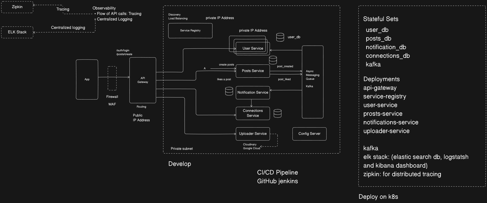

# Social Platform Project

Scalable social platform backend built using **Spring Boot microservices architecture**, featuring API Gateway, service discovery, Kafka-based event-driven communication, and PostgreSQL. :contentReference[oaicite:0]{index=0}

---

## 📌 Overview

This repository contains the backend services for a LinkedIn-like social networking platform. The system is designed using **microservices architecture**, focusing on scalability, fault tolerance, and real-world best practices such as:

- Event-driven communication with **Apache Kafka**
- Centralized **logging and distributed tracing**
- API Gateway + Service Discovery
- **Kubernetes-ready deployment**

---

## 🧠 Features

✔ Modular microservices (each with its own database)  
✔ Asynchronous communication using Kafka  
✔ API Gateway for routing, authentication & throttling  
✔ Service Registry for service discovery  
✔ Centralized Observability  
✔ CI/CD pipeline support (GitHub + Jenkins)

---

## 🏗 System Architecture

Below is the **high-level system design** showing service interactions, observability, async messaging, and deployment layout.

> The design contains API Gateway, microservices, Kafka, databases, ELK stack for logging, and Zipkin for tracing.

---

## 🔌 System Components

### 📍 API Gateway
- Routes requests from clients to internal services
- Handles authentication & authorization
- Exposes public endpoints (e.g., `/auth/login`, `/posts/create`)

### 📍 Service Registry
- Maintains instances & addresses of services
- Allows dynamic service discovery

### 📍 Microservices

| Service | Responsibility |
|---------|----------------|
| **User Service** | User management & authentication |
| **Posts Service** | Creating and liking posts |
| **Notification Service** | Sending notifications on events |
| **Connections Service** | Managing user relationships |
| **Uploader Service** | Media uploads (Cloudinary / GCP) |
| **Config Server** | Centralized configuration |

---

## 🧵 Event Driven Messaging

We use **Kafka** for asynchronous messaging between services:

**Topic Examples:**
- `post_created`
- `post_liked`

This decouples services and enables scalable processing.

---

## 📦 Technology Stack

| Layer | Tools |
|-------|-------|
| Backend | Java, Spring Boot |
| API Routing | Spring Cloud Gateway |
| Discovery | Spring Cloud Eureka |
| Messaging | Apache Kafka |
| Databases | PostgreSQL |
| Logging | ELK Stack (Elasticsearch, Logstash, Kibana) |
| Tracing | Zipkin |
| CI/CD | GitHub + Jenkins |
| Deployment | Kubernetes |

---

## 🚀 Deployment

This project is designed to be deployed on **Kubernetes** using:

- **Deployments** for stateless services
- **StatefulSets** for databases & Kafka
- Private networking for services
- API Gateway with public access

---

## 📁 Folder Structure

